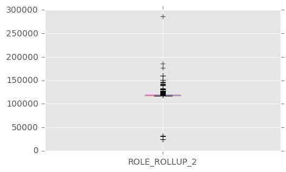
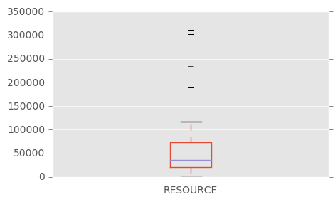
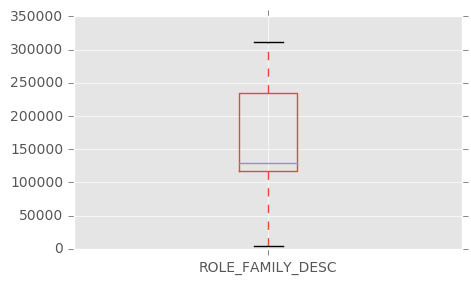

# Project Report
WE used Amazon data from kaggle for demo purpose.


# *Amazon.com Employee Chellenge*

##  Predict an employee's access needs, given his/her job role 

When an employee at any company starts work, they first need to obtain the computer access necessary to fulfill their role. This access may allow an employee to read/manipulate resources through various applications or web portals. It is assumed that employees fulfilling the functions of a given role will access the same or similar resources. It is often the case that employees figure out the access they need as they encounter roadblocks during their daily work (e.g. not able to log into a reporting portal). A knowledgeable supervisor then takes time to manually grant the needed access in order to overcome access obstacles. As employees move throughout a company, this access discovery/recovery cycle wastes a nontrivial amount of time and money.

There is a considerable amount of data regarding an employee’s role within an organization and the resources to which they have access. Given the data related to current employees and their provisioned access, models can be built that automatically determine access privileges as employees enter and leave roles within a company. These auto-access models seek to minimize the human involvement required to grant or revoke employee access.

## Objective
The objective of this competition is to build a model, learned using historical data, that will determine an employee's access needs, such that manual access transactions (grants and revokes) are minimized as the employee's attributes change over time. The model will take an employee's role information and a resource code and will return whether or not access should be granted.

## Data
The data consists of real historical data collected from 2010 & 2011 the details of columns are as follows:

|Column Name   |      Description      | 
|----------|:-------------:|
| ACTION |  ACTION is 1 if the resource was approved, 0 if the resource was not |
| RESOURCE |    An ID for each resource   |
| MGR_ID | The EMPLOYEE ID of the manager of the current EMPLOYEE ID record; an employee may have only one manager at a time |
|ROLE_ROLLUP_1 | Company role grouping category id 1 (e.g. US Engineering)|
|ROLE_ROLLUP_2 | Company role grouping category id 2 (e.g. US Retail) |
|ROLE_DEPTNAME |Company role department description (e.g. Retail)|
|ROLE_TITLE | Company role business title description (e.g. Senior Engineering Retail Manager)|
|ROLE_FAMILY | Company role family description (e.g. Retail Manager)|
|ROLE_CODE | Company role code; this code is unique to each role (e.g. Manager)|

## Data Access from Hdfs
Following snippet of code calls the required libaries and then import data from hdfs. After reading data from the hdfs the schema, data sample is shown.


```python
from pyspark.sql import SparkSession

spark = SparkSession \
    .builder \
    .appName("Python Spark SQL basic example") \
    .config("spark.some.config.option", "6g") \
    .getOrCreate()

train_file = "/home/spark/kagle/online product sale/TrainingDataset.csv"

```


```python
import pandas as pd
import numpy as np

import matplotlib.pyplot as plt
import matplotlib
matplotlib.style.use('ggplot')

from ipywidgets import widgets
```


```python
df_train = spark.read.option('header','true').csv(
    "/home/spark/kagle/amazon/train.csv")
```


```python
type(df_train)
```


    pyspark.sql.dataframe.DataFrame


```python
df_train.printSchema()
```

    root
     |-- ACTION: string (nullable = true)
     |-- RESOURCE: string (nullable = true)
     |-- MGR_ID: string (nullable = true)
     |-- ROLE_ROLLUP_1: string (nullable = true)
     |-- ROLE_ROLLUP_2: string (nullable = true)
     |-- ROLE_DEPTNAME: string (nullable = true)
     |-- ROLE_TITLE: string (nullable = true)
     |-- ROLE_FAMILY_DESC: string (nullable = true)
     |-- ROLE_FAMILY: string (nullable = true)
     |-- ROLE_CODE: string (nullable = true)
    
    


```python
df_train.show(10)
```

    +------+--------+------+-------------+-------------+-------------+----------+----------------+-----------+---------+
    |ACTION|RESOURCE|MGR_ID|ROLE_ROLLUP_1|ROLE_ROLLUP_2|ROLE_DEPTNAME|ROLE_TITLE|ROLE_FAMILY_DESC|ROLE_FAMILY|ROLE_CODE|
    +------+--------+------+-------------+-------------+-------------+----------+----------------+-----------+---------+
    |     1|   39353| 85475|       117961|       118300|       123472|    117905|          117906|     290919|   117908|
    |     1|   17183|  1540|       117961|       118343|       123125|    118536|          118536|     308574|   118539|
    |     1|   36724| 14457|       118219|       118220|       117884|    117879|          267952|      19721|   117880|
    |     1|   36135|  5396|       117961|       118343|       119993|    118321|          240983|     290919|   118322|
    |     1|   42680|  5905|       117929|       117930|       119569|    119323|          123932|      19793|   119325|
    |     0|   45333| 14561|       117951|       117952|       118008|    118568|          118568|      19721|   118570|
    |     1|   25993| 17227|       117961|       118343|       123476|    118980|          301534|     118295|   118982|
    |     1|   19666|  4209|       117961|       117969|       118910|    126820|          269034|     118638|   126822|
    |     1|   31246|   783|       117961|       118413|       120584|    128230|          302830|       4673|   128231|
    |     1|   78766| 56683|       118079|       118080|       117878|    117879|          304519|      19721|   117880|
    +------+--------+------+-------------+-------------+-------------+----------+----------------+-----------+---------+
    only showing top 10 rows
    
    


```python
print 'Number of columns:', len(df_train.columns)
print 'Number of rows:', df_train.select(df_train.columns[0]).count()
```

    Number of columns: 10
    Number of rows: 32769
    

# Exploratory Data Analysis
This step identifies the following points by showing tables and graph
1. find out missing values
2. outliner detection
3. data distribution of feautre set


```python
for i in range(0,len(df_train.columns)):
    print df_train.columns[i]
    df_train.filter(df_train[df_train.columns[i]] == '').show()
```

    ACTION
    +------+--------+------+-------------+-------------+-------------+----------+----------------+-----------+---------+
    |ACTION|RESOURCE|MGR_ID|ROLE_ROLLUP_1|ROLE_ROLLUP_2|ROLE_DEPTNAME|ROLE_TITLE|ROLE_FAMILY_DESC|ROLE_FAMILY|ROLE_CODE|
    +------+--------+------+-------------+-------------+-------------+----------+----------------+-----------+---------+
    +------+--------+------+-------------+-------------+-------------+----------+----------------+-----------+---------+
    
    RESOURCE
    +------+--------+------+-------------+-------------+-------------+----------+----------------+-----------+---------+
    |ACTION|RESOURCE|MGR_ID|ROLE_ROLLUP_1|ROLE_ROLLUP_2|ROLE_DEPTNAME|ROLE_TITLE|ROLE_FAMILY_DESC|ROLE_FAMILY|ROLE_CODE|
    +------+--------+------+-------------+-------------+-------------+----------+----------------+-----------+---------+
    +------+--------+------+-------------+-------------+-------------+----------+----------------+-----------+---------+
    
    MGR_ID
    +------+--------+------+-------------+-------------+-------------+----------+----------------+-----------+---------+
    |ACTION|RESOURCE|MGR_ID|ROLE_ROLLUP_1|ROLE_ROLLUP_2|ROLE_DEPTNAME|ROLE_TITLE|ROLE_FAMILY_DESC|ROLE_FAMILY|ROLE_CODE|
    +------+--------+------+-------------+-------------+-------------+----------+----------------+-----------+---------+
    +------+--------+------+-------------+-------------+-------------+----------+----------------+-----------+---------+
    
    ROLE_ROLLUP_1
    +------+--------+------+-------------+-------------+-------------+----------+----------------+-----------+---------+
    |ACTION|RESOURCE|MGR_ID|ROLE_ROLLUP_1|ROLE_ROLLUP_2|ROLE_DEPTNAME|ROLE_TITLE|ROLE_FAMILY_DESC|ROLE_FAMILY|ROLE_CODE|
    +------+--------+------+-------------+-------------+-------------+----------+----------------+-----------+---------+
    +------+--------+------+-------------+-------------+-------------+----------+----------------+-----------+---------+
    
    ROLE_ROLLUP_2
    +------+--------+------+-------------+-------------+-------------+----------+----------------+-----------+---------+
    |ACTION|RESOURCE|MGR_ID|ROLE_ROLLUP_1|ROLE_ROLLUP_2|ROLE_DEPTNAME|ROLE_TITLE|ROLE_FAMILY_DESC|ROLE_FAMILY|ROLE_CODE|
    +------+--------+------+-------------+-------------+-------------+----------+----------------+-----------+---------+
    +------+--------+------+-------------+-------------+-------------+----------+----------------+-----------+---------+
    
    ROLE_DEPTNAME
    +------+--------+------+-------------+-------------+-------------+----------+----------------+-----------+---------+
    |ACTION|RESOURCE|MGR_ID|ROLE_ROLLUP_1|ROLE_ROLLUP_2|ROLE_DEPTNAME|ROLE_TITLE|ROLE_FAMILY_DESC|ROLE_FAMILY|ROLE_CODE|
    +------+--------+------+-------------+-------------+-------------+----------+----------------+-----------+---------+
    +------+--------+------+-------------+-------------+-------------+----------+----------------+-----------+---------+
    
    ROLE_TITLE
    +------+--------+------+-------------+-------------+-------------+----------+----------------+-----------+---------+
    |ACTION|RESOURCE|MGR_ID|ROLE_ROLLUP_1|ROLE_ROLLUP_2|ROLE_DEPTNAME|ROLE_TITLE|ROLE_FAMILY_DESC|ROLE_FAMILY|ROLE_CODE|
    +------+--------+------+-------------+-------------+-------------+----------+----------------+-----------+---------+
    +------+--------+------+-------------+-------------+-------------+----------+----------------+-----------+---------+
    
    ROLE_FAMILY_DESC
    +------+--------+------+-------------+-------------+-------------+----------+----------------+-----------+---------+
    |ACTION|RESOURCE|MGR_ID|ROLE_ROLLUP_1|ROLE_ROLLUP_2|ROLE_DEPTNAME|ROLE_TITLE|ROLE_FAMILY_DESC|ROLE_FAMILY|ROLE_CODE|
    +------+--------+------+-------------+-------------+-------------+----------+----------------+-----------+---------+
    +------+--------+------+-------------+-------------+-------------+----------+----------------+-----------+---------+
    
    ROLE_FAMILY
    +------+--------+------+-------------+-------------+-------------+----------+----------------+-----------+---------+
    |ACTION|RESOURCE|MGR_ID|ROLE_ROLLUP_1|ROLE_ROLLUP_2|ROLE_DEPTNAME|ROLE_TITLE|ROLE_FAMILY_DESC|ROLE_FAMILY|ROLE_CODE|
    +------+--------+------+-------------+-------------+-------------+----------+----------------+-----------+---------+
    +------+--------+------+-------------+-------------+-------------+----------+----------------+-----------+---------+
    
    ROLE_CODE
    +------+--------+------+-------------+-------------+-------------+----------+----------------+-----------+---------+
    |ACTION|RESOURCE|MGR_ID|ROLE_ROLLUP_1|ROLE_ROLLUP_2|ROLE_DEPTNAME|ROLE_TITLE|ROLE_FAMILY_DESC|ROLE_FAMILY|ROLE_CODE|
    +------+--------+------+-------------+-------------+-------------+----------+----------------+-----------+---------+
    +------+--------+------+-------------+-------------+-------------+----------+----------------+-----------+---------+
    
    


```python
idx_list = [3,4,5,6,9]
for idx in idx_list:
    df_tmp = df_train.select(df_train.columns[idx]).toPandas()
    # df_tmp.plot.box()
    # pd.to_numeric(df_tmp['ACTION']).head()

    pd.to_numeric(df_tmp[df_train.columns[idx]]).plot.box(figsize=(5, 3))
    plt.show()
```





```python
idx_list =[1,2,7,8]
for idx in idx_list:
    df_tmp = df_train.select(df_train.columns[idx]).toPandas()
    # df_tmp.plot.box()
    # pd.to_numeric(df_tmp['ACTION']).head()

    pd.to_numeric(df_tmp[df_train.columns[idx]]).plot.box(figsize=(5, 3))
    plt.show()
```








```python
idx_list = [3,4,5,6,9]

for idx in idx_list:
    plt_df = df_train.groupBy(df_train.columns[idx]).count()

    df_tmp = plt_df.toPandas()
    # df_tmp[df_tmp.columns[0]]

    df_tmp.plot.bar(df_tmp.columns[0], df_tmp.columns[1],figsize=(12, 2.5))
    plt.show()
```


```python
# This code takes time, will check on spark cluster, how fast it will be computed?

# idx_list =[1,2,7,8]

# for idx in idx_list:
#     plt_df = df_train.groupBy(df_train.columns[idx]).count()

#     df_tmp = plt_df.toPandas()
#     # df_tmp[df_tmp.columns[0]]

#     df_tmp.plot.bar(df_tmp.columns[0], df_tmp.columns[1],figsize=(12, 2.5))
#     plt.show()
```


```python
plt_df = df_train.groupBy(df_train.columns[0]).count()

df_tmp = plt_df.toPandas()
# df_tmp[df_tmp.columns[0]]

df_tmp.plot.bar(df_tmp.columns[0], df_tmp.columns[1])
plt.show()
```


```python
df_train.rdd
```


    MapPartitionsRDD[112] at javaToPython at NativeMethodAccessorImpl.java:-2


# Machine Learning
1. build model


```python
import h2o

h2o.init()
```

    Checking whether there is an H2O instance running at http://localhost:54321..... not found.
    Attempting to start a local H2O server...
      Java Version: java version "1.8.0_111"; Java(TM) SE Runtime Environment (build 1.8.0_111-b14); Java HotSpot(TM) 64-Bit Server VM (build 25.111-b14, mixed mode)
      Starting server from /home/spark/anaconda2/lib/python2.7/site-packages/h2o/backend/bin/h2o.jar
      Ice root: /tmp/tmpjQFdzN
      JVM stdout: /tmp/tmpjQFdzN/h2o_spark_started_from_python.out
      JVM stderr: /tmp/tmpjQFdzN/h2o_spark_started_from_python.err
      Server is running at http://127.0.0.1:54321
    Connecting to H2O server at http://127.0.0.1:54321... successful.
    


<div style="overflow:auto"><table style="width:50%"><tr><td>H2O cluster uptime:</td>
<td>05 secs</td></tr>
<tr><td>H2O cluster version:</td>
<td>3.10.0.10</td></tr>
<tr><td>H2O cluster version age:</td>
<td>1 month and 5 days </td></tr>
<tr><td>H2O cluster name:</td>
<td>H2O_from_python_spark_3wkl29</td></tr>
<tr><td>H2O cluster total nodes:</td>
<td>1</td></tr>
<tr><td>H2O cluster free memory:</td>
<td>1.714 Gb</td></tr>
<tr><td>H2O cluster total cores:</td>
<td>4</td></tr>
<tr><td>H2O cluster allowed cores:</td>
<td>4</td></tr>
<tr><td>H2O cluster status:</td>
<td>accepting new members, healthy</td></tr>
<tr><td>H2O connection url:</td>
<td>http://127.0.0.1:54321</td></tr>
<tr><td>H2O connection proxy:</td>
<td>None</td></tr>
<tr><td>Python version:</td>
<td>2.7.12 final</td></tr></table></div>


* will try to use rdd/sparkdataframe on cluster


```python
#converted data to pandas and then imported to H2O frame
hf_train=h2o.H2OFrame(df_train.toPandas())
```

    Parse progress: |█████████████████████████████████████████████████████████| 100%
    


```python
hf_tmp = hf_train[0].asfactor()
hf_tmp =hf_tmp.cbind(hf_train[1:9])
hf_train = hf_tmp
```


```python
hf_train
```


<table>
<thead>
<tr><th style="text-align: right;">  ACTION</th><th style="text-align: right;">  RESOURCE</th><th style="text-align: right;">  MGR_ID</th><th style="text-align: right;">  ROLE_ROLLUP_1</th><th style="text-align: right;">  ROLE_ROLLUP_2</th><th style="text-align: right;">  ROLE_DEPTNAME</th><th style="text-align: right;">  ROLE_TITLE</th><th style="text-align: right;">  ROLE_FAMILY_DESC</th><th style="text-align: right;">  ROLE_FAMILY</th></tr>
</thead>
<tbody>
<tr><td style="text-align: right;">       1</td><td style="text-align: right;">     39353</td><td style="text-align: right;">   85475</td><td style="text-align: right;">         117961</td><td style="text-align: right;">         118300</td><td style="text-align: right;">         123472</td><td style="text-align: right;">      117905</td><td style="text-align: right;">            117906</td><td style="text-align: right;">       290919</td></tr>
<tr><td style="text-align: right;">       1</td><td style="text-align: right;">     17183</td><td style="text-align: right;">    1540</td><td style="text-align: right;">         117961</td><td style="text-align: right;">         118343</td><td style="text-align: right;">         123125</td><td style="text-align: right;">      118536</td><td style="text-align: right;">            118536</td><td style="text-align: right;">       308574</td></tr>
<tr><td style="text-align: right;">       1</td><td style="text-align: right;">     36724</td><td style="text-align: right;">   14457</td><td style="text-align: right;">         118219</td><td style="text-align: right;">         118220</td><td style="text-align: right;">         117884</td><td style="text-align: right;">      117879</td><td style="text-align: right;">            267952</td><td style="text-align: right;">        19721</td></tr>
<tr><td style="text-align: right;">       1</td><td style="text-align: right;">     36135</td><td style="text-align: right;">    5396</td><td style="text-align: right;">         117961</td><td style="text-align: right;">         118343</td><td style="text-align: right;">         119993</td><td style="text-align: right;">      118321</td><td style="text-align: right;">            240983</td><td style="text-align: right;">       290919</td></tr>
<tr><td style="text-align: right;">       1</td><td style="text-align: right;">     42680</td><td style="text-align: right;">    5905</td><td style="text-align: right;">         117929</td><td style="text-align: right;">         117930</td><td style="text-align: right;">         119569</td><td style="text-align: right;">      119323</td><td style="text-align: right;">            123932</td><td style="text-align: right;">        19793</td></tr>
<tr><td style="text-align: right;">       0</td><td style="text-align: right;">     45333</td><td style="text-align: right;">   14561</td><td style="text-align: right;">         117951</td><td style="text-align: right;">         117952</td><td style="text-align: right;">         118008</td><td style="text-align: right;">      118568</td><td style="text-align: right;">            118568</td><td style="text-align: right;">        19721</td></tr>
<tr><td style="text-align: right;">       1</td><td style="text-align: right;">     25993</td><td style="text-align: right;">   17227</td><td style="text-align: right;">         117961</td><td style="text-align: right;">         118343</td><td style="text-align: right;">         123476</td><td style="text-align: right;">      118980</td><td style="text-align: right;">            301534</td><td style="text-align: right;">       118295</td></tr>
<tr><td style="text-align: right;">       1</td><td style="text-align: right;">     19666</td><td style="text-align: right;">    4209</td><td style="text-align: right;">         117961</td><td style="text-align: right;">         117969</td><td style="text-align: right;">         118910</td><td style="text-align: right;">      126820</td><td style="text-align: right;">            269034</td><td style="text-align: right;">       118638</td></tr>
<tr><td style="text-align: right;">       1</td><td style="text-align: right;">     31246</td><td style="text-align: right;">     783</td><td style="text-align: right;">         117961</td><td style="text-align: right;">         118413</td><td style="text-align: right;">         120584</td><td style="text-align: right;">      128230</td><td style="text-align: right;">            302830</td><td style="text-align: right;">         4673</td></tr>
<tr><td style="text-align: right;">       1</td><td style="text-align: right;">     78766</td><td style="text-align: right;">   56683</td><td style="text-align: right;">         118079</td><td style="text-align: right;">         118080</td><td style="text-align: right;">         117878</td><td style="text-align: right;">      117879</td><td style="text-align: right;">            304519</td><td style="text-align: right;">        19721</td></tr>
</tbody>
</table>


    


```python
#split data into train and validate sets
train, validate = hf_train.split_frame(ratios=[0.75], destination_frames=['train','validate'],seed=1)
```


```python
#count the lenghts of the dataset to verify the splits
print 'length of actual data:', len(hf_train[hf_train.columns[0]])
print 'length of train data:', len(train[train.columns[0]])
print 'length of validate data:', len(validate[validate.columns[0]])
print 'total length combining train & validate data:', len(train[train.columns[0]]) + len(validate[validate.columns[0]])
```

    length of actual data: 32769
    length of train data: 24650
    length of validate data: 8119
    total length combining train & validate data: 32769
    


```python
from h2o.estimators.naive_bayes import H2ONaiveBayesEstimator
from h2o.estimators.random_forest import H2ORandomForestEstimator
from h2o.estimators.gbm import H2OGradientBoostingEstimator
```


```python
nb = H2ONaiveBayesEstimator()
nb.train(x= train.col_names[1:9],y= train.col_names[0],training_frame= train, validation_frame= validate,nfold=10)
```

    naivebayes Model Build progress: |████████████████████████████████████████| 100%
    


```python
nb.auc()
```


    0.5714191730626044


```python

```


```python
rf = H2ORandomForestEstimator()
rf.train(x= train.col_names[1:9],y= train.col_names[0],training_frame= train,\
         validation_frame= validate, nfold =10, seed = 1, ntrees=100)
```

    drf Model Build progress: |███████████████████████████████████████████████| 100%
    


```python
rf.auc()
```


    0.8320478900535409


```python
rf.plot()
```


```python
gbm = H2OGradientBoostingEstimator()
gbm.train(x= train.col_names[1:9],y= train.col_names[0],\
          training_frame= train, validation_frame= validate,\
          nutrees = 40,max_depth=15, seed=-1)
```

    gbm Model Build progress: |███████████████████████████████████████████████| 100%
    


```python
gbm.plot()
```


```python
gbm.auc()
```


    0.8402682535994782


```python
hf_test= h2o.import_file('/home/spark/kagle/amazon/test.csv')
```

    Parse progress: |█████████████████████████████████████████████████████████| 100%
    


```python
hf_tmp = hf_test[0].asfactor()
hf_tmp =hf_tmp.cbind(hf_test[1:9])
hf_test = hf_tmp
```


```python
hf_test
```


<table>
<thead>
<tr><th style="text-align: right;">  id</th><th style="text-align: right;">  RESOURCE</th><th style="text-align: right;">  MGR_ID</th><th style="text-align: right;">  ROLE_ROLLUP_1</th><th style="text-align: right;">  ROLE_ROLLUP_2</th><th style="text-align: right;">  ROLE_DEPTNAME</th><th style="text-align: right;">  ROLE_TITLE</th><th style="text-align: right;">  ROLE_FAMILY_DESC</th><th style="text-align: right;">  ROLE_FAMILY</th></tr>
</thead>
<tbody>
<tr><td style="text-align: right;">   1</td><td style="text-align: right;">     78766</td><td style="text-align: right;">   72734</td><td style="text-align: right;">         118079</td><td style="text-align: right;">         118080</td><td style="text-align: right;">         117878</td><td style="text-align: right;">      117879</td><td style="text-align: right;">            118177</td><td style="text-align: right;">        19721</td></tr>
<tr><td style="text-align: right;">   2</td><td style="text-align: right;">     40644</td><td style="text-align: right;">    4378</td><td style="text-align: right;">         117961</td><td style="text-align: right;">         118327</td><td style="text-align: right;">         118507</td><td style="text-align: right;">      118863</td><td style="text-align: right;">            122008</td><td style="text-align: right;">       118398</td></tr>
<tr><td style="text-align: right;">   3</td><td style="text-align: right;">     75443</td><td style="text-align: right;">    2395</td><td style="text-align: right;">         117961</td><td style="text-align: right;">         118300</td><td style="text-align: right;">         119488</td><td style="text-align: right;">      118172</td><td style="text-align: right;">            301534</td><td style="text-align: right;">       249618</td></tr>
<tr><td style="text-align: right;">   4</td><td style="text-align: right;">     43219</td><td style="text-align: right;">   19986</td><td style="text-align: right;">         117961</td><td style="text-align: right;">         118225</td><td style="text-align: right;">         118403</td><td style="text-align: right;">      120773</td><td style="text-align: right;">            136187</td><td style="text-align: right;">       118960</td></tr>
<tr><td style="text-align: right;">   5</td><td style="text-align: right;">     42093</td><td style="text-align: right;">   50015</td><td style="text-align: right;">         117961</td><td style="text-align: right;">         118343</td><td style="text-align: right;">         119598</td><td style="text-align: right;">      118422</td><td style="text-align: right;">            300136</td><td style="text-align: right;">       118424</td></tr>
<tr><td style="text-align: right;">   6</td><td style="text-align: right;">     44722</td><td style="text-align: right;">    1755</td><td style="text-align: right;">         117961</td><td style="text-align: right;">         117962</td><td style="text-align: right;">         119223</td><td style="text-align: right;">      125793</td><td style="text-align: right;">            146749</td><td style="text-align: right;">       118643</td></tr>
<tr><td style="text-align: right;">   7</td><td style="text-align: right;">     75834</td><td style="text-align: right;">   21135</td><td style="text-align: right;">         117961</td><td style="text-align: right;">         118343</td><td style="text-align: right;">         123494</td><td style="text-align: right;">      118054</td><td style="text-align: right;">            118054</td><td style="text-align: right;">       117887</td></tr>
<tr><td style="text-align: right;">   8</td><td style="text-align: right;">      4675</td><td style="text-align: right;">    3077</td><td style="text-align: right;">         117961</td><td style="text-align: right;">         118300</td><td style="text-align: right;">         120312</td><td style="text-align: right;">      124194</td><td style="text-align: right;">            124195</td><td style="text-align: right;">       118363</td></tr>
<tr><td style="text-align: right;">   9</td><td style="text-align: right;">     18072</td><td style="text-align: right;">   15575</td><td style="text-align: right;">         117902</td><td style="text-align: right;">         118041</td><td style="text-align: right;">         118623</td><td style="text-align: right;">      280788</td><td style="text-align: right;">            280788</td><td style="text-align: right;">       292795</td></tr>
<tr><td style="text-align: right;">  10</td><td style="text-align: right;">     22680</td><td style="text-align: right;">    4474</td><td style="text-align: right;">         117961</td><td style="text-align: right;">         118446</td><td style="text-align: right;">         119064</td><td style="text-align: right;">      118321</td><td style="text-align: right;">            118448</td><td style="text-align: right;">       290919</td></tr>
</tbody>
</table>


    


```python
prediction = gbm.predict(test_data=hf_test)
```

    gbm prediction progress: |████████████████████████████████████████████████| 100%
    


```python
print 'length of predicted column: ', len(prediction[0])
print 'length of actual column: ',len(hf_test[0])
```

    length of predicted column:  58921
    length of actual column:  58921
    


```python
# gbm.accuracy
```


```python
pred=prediction.as_data_frame()
```


```python
pred.to_csv('/home/spark/kagle/amazon/submission.csv')
```


```python
# import pysparkling.context
# hc=pysparkling.context.Context(sc)


```


```python
# df_train.createOrReplaceTempView("tst")

# sqlDF = spark.sql("SELECT * FROM tst")
# sqlDF.show()
```
